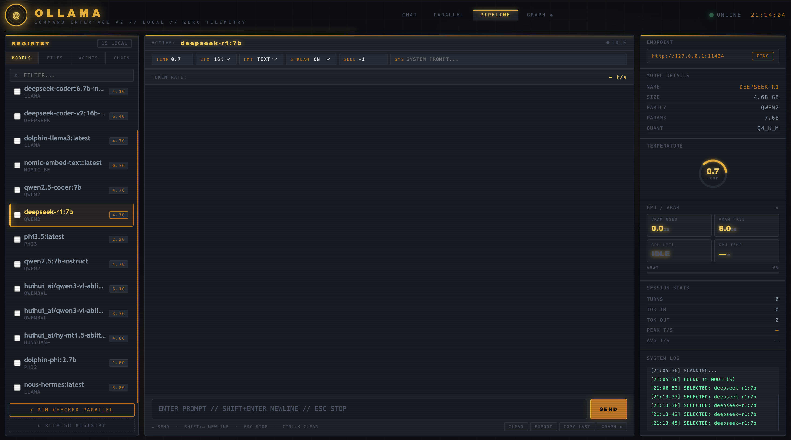

<h1 align="center"><span style="color:#cc7200;">OCI | Ollama Command Interface</span></h1>

<p align="center">
  <strong>
    <span style="color:#ffb347;">LOCAL CONTROL PLANE</span>
    <span style="color:#ff9d00;"> // </span>
    <span style="color:#e58a00;">CHAT</span>
    <span style="color:#cc7200;"> · </span>
    <span style="color:#d97b00;">PARALLEL</span>
    <span style="color:#cc7200;"> · </span>
    <span style="color:#c96a00;">AGENTS</span>
    <span style="color:#cc7200;"> · </span>
    <span style="color:#b85a00;">CHAINS</span>
    <span style="color:#cc7200;"> · </span>
    <span style="color:#a84d00;">GRAPH EXPORT</span>
  </strong>
</p>

<p align="center">
  Local-only Ollama GUI. No remote endpoints.
</p>

## What This Is

OCI is a single-page local interface for running Ollama workflows with:

- Chat
- Parallel model runs
- Agents
- Chains (pipeline steps)
- Graph visualization
- Full-session export

All runtime traffic is constrained to localhost endpoints.

## Start The Program

1. Start Ollama:
```bash
ollama serve
```
2. Start OCI:
```bash
npm start
```
3. Open in browser:
`http://127.0.0.1:8765/ollama_gui.html`

Optional auto-open:
```bash
npm run start:browser
```

## GUI Example

<p align="center">
  
</p>

## How To Use Files

1. Open the `FILES` tab in the left panel.
2. Drag-and-drop or choose files (`.txt`, `.md`, `.pdf`, `.docx`).
3. Keep files marked `ACTIVE` to inject them into prompts.
4. Disable a file to exclude it from inference context.
5. Remove files from the list to fully drop them from session context.

Behavior:
- Active files are prepended into prompt context in chat, parallel runs, agents, and pipeline steps.

## How To Use Agents

1. Open `AGENTS` in the left panel.
2. Click `+ NEW AGENT`.
3. Set:
   - Agent name
   - Model
   - System prompt
   - Execution mode (`SEQUENTIAL` or `PARALLEL`)
   - Feed target
4. Save the agent.
5. Run one agent with `RUN`, or run all with `RUN ALL`.

Behavior:
- Agent outputs are written into the main session transcript.
- Parallel agents execute concurrently when `RUN ALL` is used.

## How To Use Chains (Pipeline)

1. Open `CHAIN` in the left panel.
2. Click `+ ADD STEP`.
3. For each step set:
   - Model
   - Optional system prompt
   - Template (`{{input}}` supported)
4. Add multiple steps in order.
5. Enter seed input in the main prompt box.
6. Click `RUN PIPE`.

Behavior:
- Each step output becomes next step input.
- Step messages are appended to the main transcript and reflected in graph extraction.

## Export Behavior (Confirmed)

Export is implemented in `files/ollama_gui.html` and includes:

- Full transcript from all rendered session messages (chat + parallel + agent + pipeline)
- Explicit `PARALLEL CONVERSATIONS` section
- Agent configuration snapshot
- Pipeline configuration snapshot
- Graph nodes/edges snapshot
- File snapshot

Code references:
- `files/ollama_gui.html:1173` (`collectTranscript()`)
- `files/ollama_gui.html:1189` (`expChat()`)
- `files/ollama_gui.html:1237` (`PARALLEL CONVERSATIONS` section)

## Commands

| Command | Purpose |
|---------|---------|
| `npm start` | Start OCI without opening browser |
| `npm run start:browser` | Start OCI and open browser |

## Project Layout

```text
.
├── README.md
├── package.json
└── files/
    ├── launch_ollama_gui.py
    ├── ollama_gui.html
    └── img2377dag8adw7g.png
```
